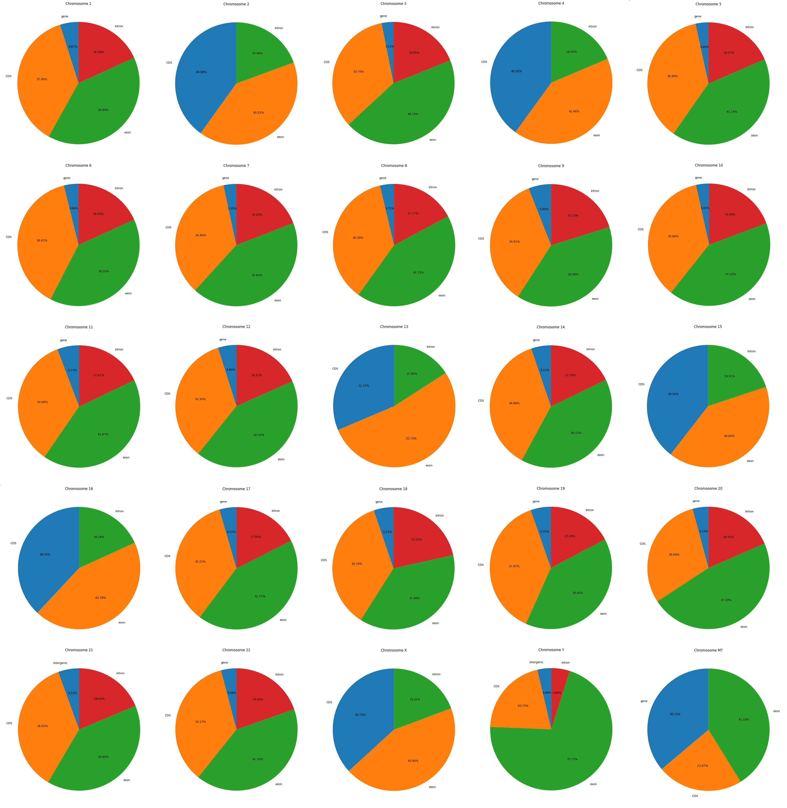

# Mapeo de mutaciones a regiones genómicas

# José Antonio Sánchez Villicaña

## Introducción

El análisis de las mutaciones que causan enfermedades mendelianas en el genoma humano es de vital importancia para la medicina genómica. Identificar las regiones del genoma donde se concentran estas mutaciones nos permite entender mejor los mecanismos genéticos subyacentes a estas enfermedades, lo que puede conducir a diagnósticos más precisos y a la identificación de nuevos objetivos terapéuticos. Este tipo de análisis también puede revelar patrones de variación genética que son críticos para desarrollar estrategias de prevención y tratamiento personalizadas, mejorando así la calidad de vida de los pacientes afectados.

Además, este análisis proporciona valiosas perspectivas para la investigación genética. Al mapear y categorizar las mutaciones en diferentes regiones genómicas, los científicos pueden explorar la relación entre la estructura del genoma y la función génica. Esto puede ayudar a descubrir nuevos genes implicados en enfermedades, comprender mejor la regulación génica y la expresión de genes, y avanzar en el desarrollo de terapias génicas. En última instancia, el conocimiento obtenido a través de este tipo de investigaciones puede transformar nuestra capacidad para abordar enfermedades mendelianas y otras condiciones genéticas, promoviendo avances significativos en la biomedicina y la salud pública.

## Metodología

Para llevar a cabo este análisis, se descargaron las mutaciones de la base de datos CLINVAR, filtrando aquellas que provienen del registro de OMIM, que contiene información detallada sobre mutaciones asociadas a enfermedades mendelianas. Posteriormente, se descargó el genoma de referencia GRCh38.p14, el cual se utilizó para identificar y categorizar las diferentes regiones genómicas, tales como intrones, exones, regiones codificantes (CDS) y genes completos.

Se desarrolló un código propio que, a partir del genoma de referencia, identifica estas regiones genómicas. Utilizando una búsqueda binaria, se realizó el mapeo de cada mutación en la región correspondiente de cada cromosoma. Este enfoque permite una asignación precisa y eficiente de las mutaciones a sus respectivas regiones genómicas. Regiones con menos del 3% de las mutaciones en ese cromosoma se excluyeron del análisis.

Finalmente, se graficaron los porcentajes de mutaciones en cada una de las regiones mencionadas para cada cromosoma, proporcionando una representación visual clara y concisa de la distribución de las mutaciones causantes de enfermedades mendelianas en el genoma humano. Este análisis no solo aporta información crucial para la comprensión de la genética de las enfermedades mendelianas, sino que también sienta las bases para futuros estudios y aplicaciones en la medicina genómica.

## Resultados

### Análisis general

Rápidamente podemos observar una cierta tendencia entre los cromosomas autosómicos, visto a partir del patrón de colores en la figura 1. En su gran mayoría se tiene la mayoría de las mutaciones cayendo en regiones codificantes (CDS y exones). Los cromosomas que parecen tener un patrón distinto (2, 13 y 16) realmente siguen la tendencia de los demás pero muestran un mejor mapeo, al no tener mutaciones en la región 'gene'. Realmente bajo la construcción de este análisis, una región génica está constituida de intrones, exones y CDS, por lo que mutaciones mapeadas a lo que las propias anotaciones del genoma de referencia define como gene son una muestra del margen de error de este análisis. No debería haber regiones dentro de un gen que no estén cubiertas por nuestras tres regiones intragénicas. Esos pequeños porcentajes en la mayoría de los cromosomas autosómicos pueden considerarse márgenes de error.

Tanto los cromosomas sexuales como el cromosoma mitocondrial claramente salen del patrón del resto de cromosomas autosómicos. El cromosoma Y de hecho, es el único cromosoma que muestra tener un porcentaje de mutaciones mayor al 3% en regiones intergénicas no codificantes. De los cromosomas sexuales, el X es el que tiene un comportamiento más parecido al resto, lo que podría explicarse con el hecho de que tiene un número de mutaciones (102,764) más comparable al resto que el cromosoma Y (82). El muy bajo número de mutaciones actualmente relacionadas a este cromosoma es un reflejo de la hasta hace poco, falta de conocimiento acerca del cromosoma sexual masculino derivada de su incompleta secuenciación. Es de esperarse que con la reciente secuenciación completa de este cromosoma, también encontremos más mutaciones relacionadas a enfermedades mendelianas y tal vez su tendencia cambie a parecerse más al resto. El cromosoma mitocondrial parece tener el mayor porcentaje de error en nuestro mapeo, teniendo casi en su mayoría mutaciones siendo mapeadas a la región 'gene'.

_Figura 1: Distribuciones de las mutaciones mendelianas en las distintas regiones genómicas para todos los cromosomas._

### Análisis cromosoma sexual

Resulta relevante analizar un poco más detenidamente el cromosoma X, porque además de presentar la misma tendencia que los demás cromosomas autosómicos, también es uno de los cromosomas que no presentan este margen de error significativo. Esto puede deberse a algunas cosas. Entre ellas puede estar una mayor claridad en la anotación de este cromosoma, con menos sobrelapes, lo que lleva a una mayor asertividad del algoritmo de búsqueda binaria.

La conservación de la tendencia con los demás cromosomas autosómicas puede explicarse con el hecho de que se tiene mucho mejor estudiado el cromosoma X que el cromosoma Y. Gracias a que la secuencia de este cromosoma lleva disponible bastante más tiempo que su contraparte, hay más estudios relacionando mutaciones a enfermedades y a su vez encontrándolas en el cromosoma. También es el posible motivo de la mejor anotación de su secuencia. 

_Figura 2: mutaciones mendelianas en el cromosoma sexual X._

### Análisis cromosoma mitocondrial

Es interesante señalar que el cromosoma mitocondrial sale de la tendencia general de varias maneras, pero sobresalta el aparente disparo del margen de error aquí. Como ya se mencionó, este error de mapeo puede deberse a un error en la metodología. También puede deberse a un error en la forma en la que estas regiones genómicas se definen en este estudio o en el mismo genoma de referencia, teniendo muchos sobrelapes de regiones e inconsistencias que puedan facilitar la definición conceptual de las mismas. Es probable que este cromosoma tenga muchas de estas características que provocan al algoritmo equivocarse y no poder determinar una región intragénica correctamente. Sería interesante analizar con mayor detenimiento la anotación de este cromosoma para detectar áreas de oportunidad de mejora para la metodología presentada en este análisis.

_Figura 3: mutaciones mendelianas en el cromosoma mitocondrial._

## Conclusiones

El análisis presentado aquí sugiere que las mutaciones que provocan enfermedades mendelianas descritas hasta la fecha tienen una distribución conservada en las regiones genómicas. Los cromosomas autosómicos y el cromosoma X, que han sido mejor estudiados, indican un mecanismo de mutación en estas regiones que podría estar siendo seleccionado evolutivamente sobre las mutaciones en regiones no codificantes. Esto tiene sentido considerando que las mutaciones no relacionadas con enfermedades, que no se incluyeron en este análisis, pueden acumularse en regiones repetitivas u otras regiones no codificantes sin provocar un fenotipo, lo que explica su exclusión actual. Además, las mutaciones en regiones no codificantes pero regulatorias pueden ser más deletéreas al afectar directamente la expresión génica, lo que podría impedir que se establezcan en la población, evitando su consideración.

Una limitación de este tipo de análisis es que muchas enfermedades pueden ser multifactoriales, es decir, provocadas por más de una mutación puntual y/o por otros mecanismos además de los genómicos, y por lo tanto, no están siendo considerados aquí. Las conclusiones deben limitarse a enfermedades mendelianas, asumiendo que nuestra información puede no estar completa, y por ende, deben tomarse con cautela. Este análisis representa un primer acercamiento a un estudio de este tipo. La metodología puede mejorarse para aumentar la confianza en las conclusiones derivadas de los resultados. Pruebas adicionales y un análisis dedicado a entender el motivo detrás de las mutaciones mapeadas en la región 'gene' ayudarán a refinar el algoritmo, así como a aumentar su eficiencia computacional.

## Reproducibilidad

Link para descarga de la lista de mutaciones: https://ftp.ncbi.nlm.nih.gov/pub/clinvar/vcf_GRCh38/clinvar.vcf.gz

Link para descarga del genoma de referencia utilizado: https://ftp.ncbi.nlm.nih.gov/genomes/all/GCA/000/001/405/GCA_000001405.29_GRCh38.p14/GCA_000001405.29_GRCh38.p14_genomic.gff.gz

Link al repositorio con el código utilizado para este análisis: https://github.com/JoseSanchezVillicana/Mutations-mapping-to-Genomic-Regions

